# 🧾 Comprehensive Tutorial: Public Funds Escrow Smart Contract

This comprehensive tutorial covers both the on-chain validator (`PublicFunds.hs`) and off-chain code (`Main.hs`) for a multi-signature escrow smart contract. This system enables secure fund management requiring multiple approvals before release.

---

## 📚 Table of Contents

1. [📦 Imports Overview](#1-imports-overview)
2. [🗃️ Data Structures](#2-data-structures)
3. [🔧 On-Chain Helper Functions](#3-on-chain-helper-functions)
4. [🧠 Core Validator Logic](#4-core-validator-logic)
5. [⚙️ Validator Script Compilation](#5-validator-script-compilation)
6. [🔌 Off-Chain Components](#6-off-chain-components)
7. [🔄 Contract Endpoints](#7-contract-endpoints)
8. [🎮 Emulator Trace](#8-emulator-trace)
9. [🚀 Deployment Workflow](#9-deployment-workflow)
10. [🧪 Testing Strategy](#10-testing-strategy)
11. [✅ Best Practices](#11-best-practices)
12. [📘 Glossary of Terms](#12-glossary-of-terms)

---

## 🏗️ System Architecture

### Complete System Architecture Diagram

```mermaid
graph TB
    subgraph "Cardano Blockchain"
        SC[Smart Contract<br/>PublicFunds.hs]
        UTXO1[UTxO 1: Locked Funds<br/>Datum: Approvals = []]
        UTXO2[UTxO 2: Updated State<br/>Datum: Approvals = [O1]]
        UTXO3[UTxO 3: Final State<br/>Datum: Approvals = [O1, O2]]
        
        SC --> UTXO1
        UTXO1 -- Approve --> UTXO2
        UTXO2 -- Approve --> UTXO3
        UTXO3 -- Release --> EMPTY[Funds Released]
    end
    
    subgraph "Actors & Wallets"
        D[Depositor<br/>Wallet 1]
        B[Beneficiary<br/>Wallet 2]
        O1[Official 1<br/>Wallet 3]
        O2[Official 2<br/>Wallet 4]
    end
    
    subgraph "Off-Chain Interface"
        EP1[lock Endpoint]
        EP2[approve Endpoint]
        EP3[release Endpoint]
        EP4[refund Endpoint]
        
        EP1 --> SC
        EP2 --> SC
        EP3 --> SC
        EP4 --> SC
    end
    
    D --> EP1
    O1 --> EP2
    O2 --> EP2
    B --> EP3
    D --> EP4
    
    style SC fill:#e1f5fe,stroke:#01579b,stroke-width:2px
    style UTXO1 fill:#fff8e1,stroke:#ff6f00
    style UTXO2 fill:#fff8e1,stroke:#ff6f00
    style UTXO3 fill:#fff8e1,stroke:#ff6f00
    style D fill:#f3e5f5,stroke:#4a148c
    style B fill:#e8f5e8,stroke:#1b5e20
    style O1 fill:#fff3e0,stroke:#e65100
    style O2 fill:#fff3e0,stroke:#e65100
```

### Data Flow Architecture

```mermaid
flowchart TD
    subgraph "Input Layer"
        A[Deposit Request<br/>from Depositor]
        B[Approval Request<br/>from Official]
        C[Release Request<br/>from Beneficiary]
        D[Refund Request<br/>from Depositor]
    end
    
    subgraph "Validation Layer"
        V1[Signature Validation]
        V2[Time Validation]
        V3[Approval Counting]
        V4[Role Authorization]
    end
    
    subgraph "Business Logic"
        L1[Check Deadline]
        L2[Count Approvals]
        L3[Verify Signatures]
        L4[Update State]
    end
    
    subgraph "State Management"
        S1[Initial State<br/>Datum: approvals = []]
        S2[Intermediate State<br/>Datum: approvals = [O1]]
        S3[Final State<br/>Datum: approvals = [O1, O2]]
    end
    
    subgraph "Output Actions"
        O1[Funds Released to Beneficiary]
        O2[Funds Refunded to Depositor]
        O3[State Updated on Blockchain]
        O4[Transaction Recorded]
    end
    
    A --> V1
    A --> V2
    A --> L4 --> S1
    
    B --> V1
    B --> V3
    B --> V4
    B --> L2 --> L4 --> S2
    
    C --> V1
    C --> V2
    C --> V3
    C --> L1
    C --> L2
    C --> L3 --> O1
    
    D --> V1
    D --> V2
    D --> V3
    D --> L1
    D --> L2 --> O2
    
    S1 --> B
    S2 --> B
    S2 --> C
    
    O1 --> O4
    O2 --> O4
    O3 --> O4
    
    style A fill:#e3f2fd
    style B fill:#f3e5f5
    style C fill:#e8f5e8
    style D fill:#fff3e0
    style V1 fill:#ffebee
    style V2 fill:#e8eaf6
    style V3 fill:#f1f8e9
    style V4 fill:#fffde7
```

---

## 1. 📦 Imports Overview

### On-Chain Imports (`PublicFunds.hs`)

| Module | Purpose |
|--------|---------|
| `Plutus.V2.Ledger.Api` | Core Plutus types: `Validator`, `ScriptContext`, `PubKeyHash` |
| `Plutus.V2.Ledger.Contexts` | Transaction context utilities: `txSignedBy`, `scriptContextTxInfo` |
| `Plutus.V1.Ledger.Interval` | Time interval operations: `contains`, `to`, `from` |
| `PlutusTx` | Template Haskell compilation: `compile`, `unstableMakeIsData` |
| `PlutusTx.Prelude` | Inlinable Plutus functions |
| `Codec.Serialise` | Script serialization to file |
| `Data.ByteString` | Byte string manipulation |
| `Cardano.Api` | Cardano node integration |

### Off-Chain Imports (`Main.hs`)

| Module | Purpose |
|--------|---------|
| `Control.Monad` | Monadic operations |
| `Ledger` | Wallet and address utilities |
| `Ledger.Ada` | ADA handling and value construction |
| `Plutus.Contract` | Contract monad and endpoints |
| `Plutus.Trace.Emulator` | Emulator trace execution |
| `Wallet.Emulator.Wallet` | Mock wallet management |
| `OnChain.PublicFunds` | Import of the on-chain validator |

---

## 2. 🗃️ Data Structures

### On-Chain Data Types

#### `EscrowDatum`
The contract state stored on-chain:


| Field | Type | Description |
|-------|------|-------------|
| `edDepositor` | `PubKeyHash` | Fund depositor's public key hash |
| `edBeneficiary` | `PubKeyHash` | Intended recipient's public key hash |
| `edOfficials` | `[PubKeyHash]` | List of m authorized officials |
| `edApprovals` | `[PubKeyHash]` | Accumulated approval signatures |
| `edRequired` | `Integer` | Minimum approvals needed (n ≤ m) |
| `edDeadline` | `POSIXTime` | Deadline for action execution |

#### `EscrowAction`
The redeemer type for state transitions:

| Action | Purpose | Required Signer |
|--------|---------|-----------------|
| `Approve` | Official adds approval | Approving official |
| `Release` | Beneficiary claims funds | Beneficiary |
| `Refund` | Depositor reclaims funds | Depositor |

---

## 3. 🔧 On-Chain Helper Functions

### Signature and Time Validation

```haskell
{-# INLINABLE signedBy #-}
signedBy :: PubKeyHash -> ScriptContext -> Bool
```
Checks if a specific public key signed the transaction.

```haskell
{-# INLINABLE beforeDeadline #-}
beforeDeadline :: POSIXTime -> ScriptContext -> Bool

{-# INLINABLE afterDeadline #-}
afterDeadline :: POSIXTime -> ScriptContext -> Bool
```
Validates transaction timing relative to deadline.

### Approval Logic

```haskell
{-# INLINABLE uniqueApproval #-}
uniqueApproval :: PubKeyHash -> EscrowDatum -> Bool
```
Ensures an official approves only once and is authorized.

---

## 4. 🧠 Core Validator Logic

### `mkValidator` Function
The main validation logic with three execution paths:

#### **Approve Path**
```haskell
Approve ->
    traceIfFalse "deadline passed" (beforeDeadline (edDeadline d) ctx) &&
    traceIfFalse "invalid approver" (uniqueApproval signer d)
```
**Conditions:**
- Must execute before deadline
- Exactly one signer required
- Signer must be an unauthorized official

#### **Release Path**
```haskell
Release ->
    traceIfFalse "deadline passed" (beforeDeadline (edDeadline d) ctx) &&
    traceIfFalse "not enough approvals" (length (edApprovals d) >= edRequired d) &&
    traceIfFalse "beneficiary signature missing" (signedBy (edBeneficiary d) ctx)
```
**Conditions:**
- Must execute before deadline
- Minimum approvals met (n)
- Beneficiary signature required

#### **Refund Path**
```haskell
Refund ->
    traceIfFalse "deadline not reached" (afterDeadline (edDeadline d) ctx) &&
    traceIfFalse "approvals already sufficient" (length (edApprovals d) < edRequired d) &&
    traceIfFalse "depositor signature missing" (signedBy (edDepositor d) ctx)
```
**Conditions:**
- Must execute after deadline
- Insufficient approvals
- Depositor signature required

---

## 5. ⚙️ Validator Script Compilation

### Type Conversion Wrapper

```haskell
{-# INLINABLE mkValidatorUntyped #-}
mkValidatorUntyped :: BuiltinData -> BuiltinData -> BuiltinData -> ()
```
Wraps the typed validator for Plutus on-chain compatibility.

### Script Compilation

```haskell
validator :: Validator
validator =
    mkValidatorScript
        $$(PlutusTx.compile [|| mkValidatorUntyped ||])
```
Compiles the validator to Plutus Core for blockchain deployment.

---

## 6. 🔌 Off-Chain Components

### Contract Schema

```haskell
type EscrowSchema =
        Endpoint "lock" ()
    .\/ Endpoint "approve" ()
    .\/ Endpoint "release" ()
    .\/ Endpoint "refund" ()
```
Defines the available contract endpoints.

### Script Address

```haskell
escrowAddress :: Address
escrowAddress = scriptAddress validator
```
Derives the script address from the compiled validator.

### Datum Creation Helper

```haskell
mkDatum :: Wallet -> Wallet -> [Wallet] -> POSIXTime -> EscrowDatum
mkDatum depositor beneficiary officials deadline =
    EscrowDatum
        { edDepositor   = mockWalletPaymentPubKeyHash depositor
        , edBeneficiary = mockWalletPaymentPubKeyHash beneficiary
        , edOfficials   = fmap mockWalletPaymentPubKeyHash officials
        , edApprovals   = []
        , edRequired    = 2
        , edDeadline    = deadline
        }
```
Creates initial datum with empty approvals list.

---

## 7. 🔄 Contract Endpoints

### Workflow Sequence Diagram

```mermaid
sequenceDiagram
    participant D as Depositor<br/>(Wallet 1)
    participant O1 as Official 1<br/>(Wallet 3)
    participant O2 as Official 2<br/>(Wallet 4)
    participant B as Beneficiary<br/>(Wallet 2)
    participant SC as Smart Contract
    participant BC as Blockchain
    
    Note over D,B: Phase 1: Fund Locking
    D->>SC: lock() with 10 ADA
    Note right of D: Parameters:<br/>- Beneficiary: Wallet 2<br/>- Officials: [W3, W4]<br/>- Required: 2<br/>- Deadline: 20,000
    SC->>BC: Create UTxO with initial datum<br/>(approvals = [])
    BC-->>SC: UTxO created
    
    Note over D,B: Phase 2: Approval Process
    O1->>SC: approve()
    Note right of O1: Must be before deadline
    SC->>BC: Update datum<br/>(approvals = [O1])
    BC-->>SC: State updated
    
    O2->>SC: approve()
    Note right of O2: Must be before deadline<br/>Must not have approved before
    SC->>BC: Update datum<br/>(approvals = [O1, O2])
    BC-->>SC: State updated
    
    Note over D,B: Phase 3: Fund Release
    B->>SC: release()
    Note right of B: Must be before deadline<br/>Must have ≥2 approvals<br/>Must be beneficiary
    SC->>BC: Validate all conditions
    BC-->>B: Transfer 10 ADA
    
    Note over D,B: Alternative: Refund Scenario
    alt Insufficient approvals by deadline
        D->>SC: refund()
        Note right of D: Must be after deadline<br/>Must have <2 approvals<br/>Must be depositor
        SC->>BC: Validate refund conditions
        BC-->>D: Return 10 ADA
    end
```



### `lock` Endpoint

```haskell
lock :: Contract () EscrowSchema Text ()
lock = do
    let datum = mkDatum (knownWallet 1) (knownWallet 2)
                    [knownWallet 3, knownWallet 4] 20_000
        tx = mustPayToTheScript datum (Ada.lovelaceValueOf 10_000_000)
    void $ submitTxConstraints validator tx
```
**Purpose:** Locks funds in the escrow contract with initial datum.

### `approve` Endpoint

```haskell
approve :: Contract () EscrowSchema Text ()
approve = do
    utxos <- utxosAt escrowAddress
    case utxos of
        [(oref, _)] ->
            void $ submitTxConstraintsSpending validator utxos
                (mustSpendScriptOutput oref (Redeemer $ toBuiltinData Approve))
        _ -> logError @String "No script UTxO"
```
**Purpose:** Official adds their approval to the escrow.

### `release` Endpoint

```haskell
release :: Contract () EscrowSchema Text ()
release = do
    utxos <- utxosAt escrowAddress
    case utxos of
        [(oref, _)] ->
            void $ submitTxConstraintsSpending validator utxos
                (mustSpendScriptOutput oref (Redeemer $ toBuiltinData Release))
        _ -> logError @String "No script UTxO"
```
**Purpose:** Beneficiary claims funds after sufficient approvals.

---

## 8. 🎮 Emulator Trace

### Complete Workflow Simulation

```haskell
trace :: EmulatorTrace ()
trace = do
    -- Wallet 1 locks funds
    h1 <- activateContractWallet (knownWallet 1) lock
    void $ Emulator.waitNSlots 1

    -- Official 3 approves
    h3 <- activateContractWallet (knownWallet 3) approve
    void $ Emulator.waitNSlots 1

    -- Official 4 approves (reaching required 2 approvals)
    h4 <- activateContractWallet (knownWallet 4) approve
    void $ Emulator.waitNSlots 1

    -- Beneficiary releases funds
    h2 <- activateContractWallet (knownWallet 2) release
    void $ Emulator.waitNSlots 1
```

### State Transition Diagram

```mermaid
stateDiagram-v2
    [*] --> Locked
    Locked --> Approved1 : Official 1 approves
    Approved1 --> Approved2 : Official 2 approves
    Approved2 --> Released : Beneficiary releases
    
    Locked --> Refunded : Deadline passes<br/>(approvals < required)
    Approved1 --> Refunded : Deadline passes<br/>(approvals < required)
    
    state Locked {
        [*] --> WaitingForApprovals
        WaitingForApprovals --> HasSomeApprovals : At least 1 approval
    }
    
    state Approved2 {
        ReadyForRelease : 2 approvals ≥ required
    }
    
    Released --> [*]
    Refunded --> [*]
```



---

## 9. 🚀 Deployment Workflow

### Deployment Architecture

```mermaid
flowchart LR
    subgraph "Development"
        D1[Write Haskell Code]
        D2[Compile with GHC]
        D3[Test with Emulator]
    end
    
    subgraph "Build Process"
        B1[Compile Validator<br/>to Plutus Core]
        B2[Serialize to<br/>.plutus file]
        B3[Generate Script Address]
    end
    
    subgraph "Deployment"
        DP1[Load to PAB<br/>(Plutus App Backend)]
        DP2[Initialize Contract]
        DP3[Fund Contract Address]
        DP4[Distribute Credentials]
    end
    
    subgraph "Production"
        P1[Cardano Testnet]
        P2[Script Execution]
        P3[Fund Management]
    end
    
    D1 --> D2 --> D3
    D3 --> B1 --> B2 --> B3
    B3 --> DP1 --> DP2 --> DP3 --> DP4
    DP4 --> P1 --> P2 --> P3
    
    style D1 fill:#e1f5fe
    style B1 fill:#fff8e1
    style DP1 fill:#f3e5f5
    style P1 fill:#e8f5e8
```

### Step 1: Compile Validator
```bash
cabal build
```

### Step 2: Run Emulator Test
```bash
cabal run public-funds-emulator
```

### Step 3: Serialize Script (Example)
```haskell
-- Save validator to file
saveVal :: IO ()
saveVal = writeValidatorToFile "escrow.plutus" validator
```

### Step 4: Deploy to Testnet
1. Load validator in Plutus Application Backend (PAB)
2. Initialize contract with parameters
3. Fund the contract address
4. Distribute approval credentials to officials

---

## 10. 🧪 Testing Strategy

### Test Architecture


### Unit Tests
- **Individual Actions:** Test each redeemer in isolation
- **Time Boundaries:** Transactions at deadline ± 1 slot
- **Signature Validation:** Correct/incorrect signers for each action

### Integration Tests
- **Complete Workflow:** Lock → Approve × n → Release
- **Failed Release:** Attempt release with insufficient approvals
- **Timeout Refund:** Allow deadline to pass, then refund
- **Duplicate Approval:** Attempt same official approving twice

### Edge Cases
- Empty officials list
- Zero required approvals (immediate release)
- All officials required (n = m)
- Single official (n = m = 1)
- Deadline in past at contract creation

---

## 11. ✅ Best Practices

### Security Considerations
1. **Parameter Validation:** Ensure n ≤ m during datum creation
2. **Time Handling:** Use strict inequalities for deadline checks
3. **Signature Enforcement:** Require exact signers for each action
4. **Approval Tracking:** Prevent duplicate approvals through list membership checks

### Gas Optimization
1. **List Operations:** Consider gas costs for large m values
2. **Datum Size:** Keep approval list reasonable (off-chain tracking alternative)
3. **Script Complexity:** Minimize trace operations in production

### User Experience
1. **Clear Error Messages:** Use descriptive `traceIfFalse` messages
2. **Off-Chain Tracking:** Maintain approval state off-chain for UI
3. **Deadline Notifications:** Alert stakeholders approaching deadlines
4. **Multi-Signature Tools:** Provide tools for official coordination

---

## 12. 📘 Glossary of Terms

| Term | Definition |
|------|------------|
| **Escrow** | Funds held by a third party until conditions are met |
| **Multi-Signature** | Authorization requiring multiple signatures |
| **m-of-n** | Governance requiring m approvals from n officials |
| **Datum** | On-chain state data determining contract behavior |
| **Redeemer** | Action specification triggering state transitions |
| **PubKeyHash** | Cryptographic hash of a public key |
| **POSIXTime** | Unix timestamp for deadline specification |
| **Validator** | Smart contract logic validating transactions |
| **ScriptContext** | Transaction context (signatures, time, inputs/outputs) |
| **Emulator Trace** | Simulation environment for testing smart contracts |
| **Contract Endpoint** | Off-chain interface for user interaction |
| **UTxO** | Unspent Transaction Output (blockchain state element) |
| **Bech32** | Human-readable address encoding used in Cardano |

---

## 🎯 Project Requirements Alignment

### Anti-Corruption Features Implemented


This escrow system provides robust multi-signature governance suitable for:
- **Government Fund Management:** Preventing unauthorized access to public funds
- **Grant Disbursements:** Ensuring proper oversight before release
- **Corporate Approvals:** Requiring multiple signatures for large transactions
- **DAO Fund Allocation:** Transparent, community-governed fund distribution
- **Anti-Corruption Systems:** Creating accountable, auditable fund release mechanisms

The system successfully implements all required features for the CP108 Final Project, providing a complete anti-corruption solution for public fund management through blockchain automation.
